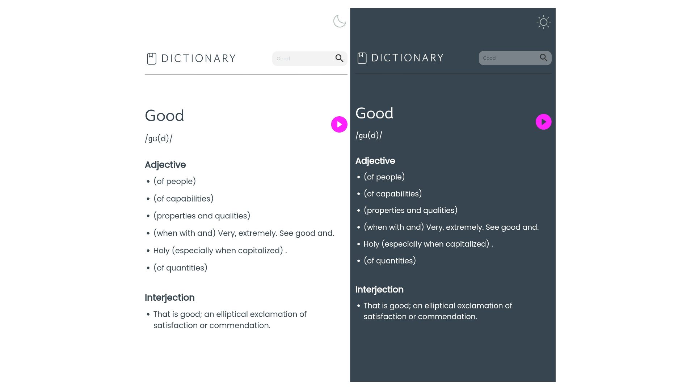

<!-- Please update value in the {}  -->

<h1 align="center">Dictionary App</h1>

   A dictionary application built using Next.js.

  <h3>
    <a href="https://precious-odukwe-dictionary-app.netlify.app">
      App
    </a>

<!-- TABLE OF CONTENTS -->

## Table of Contents

- [Overview](#overview)
  - [Built With](#built-with)
- [Features](#features)
- [Contact](#contact)

<!-- OVERVIEW -->

## Overview

Introduce your projects by taking a screenshot or a gif. Try to tell visitors a story about your project by answering:

### Built With

<!-- This section should list any major frameworks that you built your project using. Here are a few examples.-->

- [Next.js](https://nextjs.org/)
- [Redux Toolkit](https://redux-toolkit.js.org/)
- [Dictionary API](https://dictionaryapi.dev/)

## Features

<!-- List the features of your application or follow the template. Don't share the figma file here :) -->

This is a dictionary application. 
The application makes use of a dictionary API to fetch data on the words you search. 
For state management, I made use of Redux ToolKit.

## Contact

- GitHub [@PreciousOdukwe](https://github.com/precious654)
- X(Twitter) [@Precious_Odukwe](https://twitter.com/precious_odukwe)
